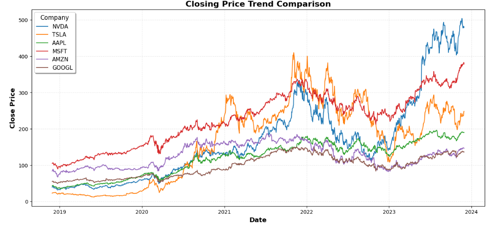
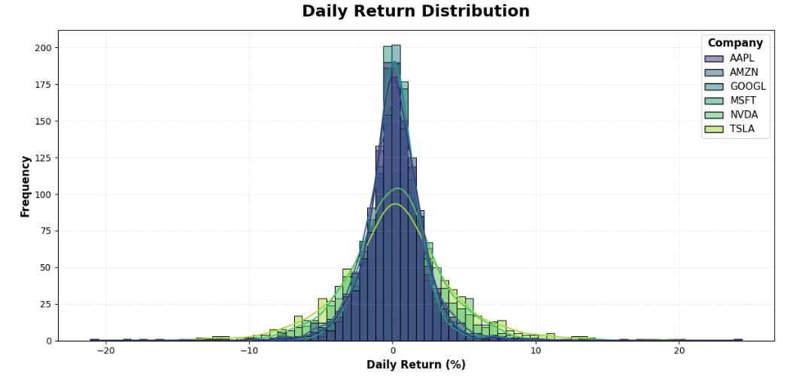
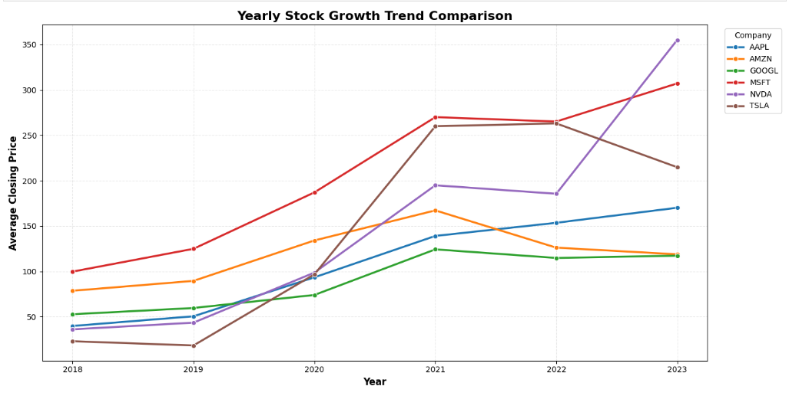
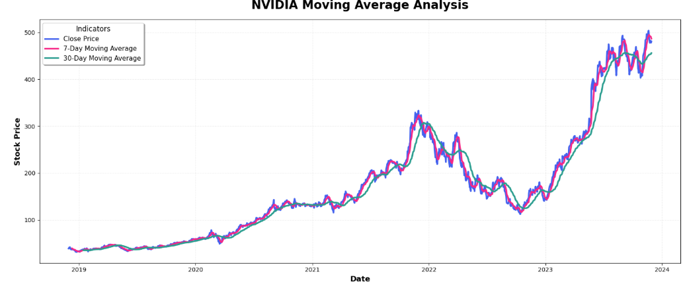
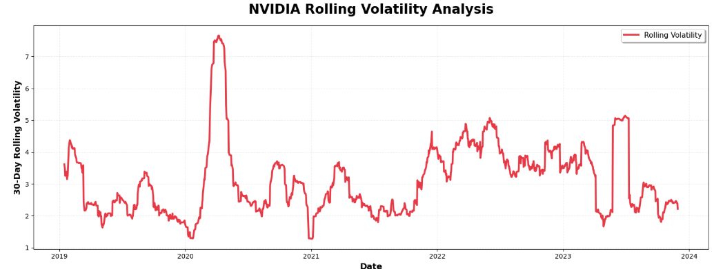
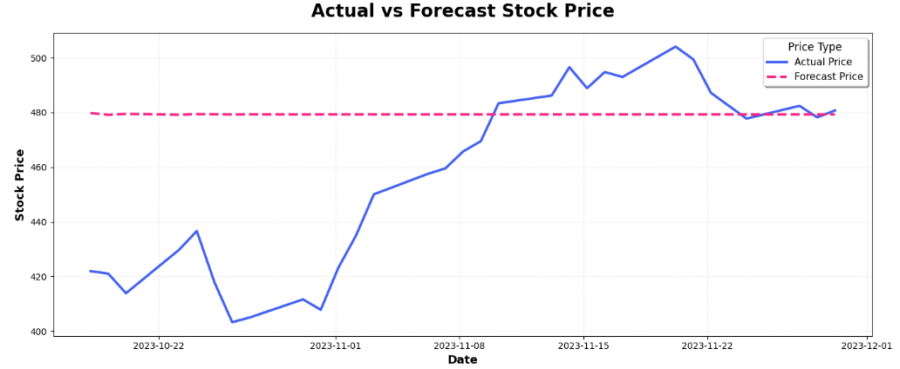
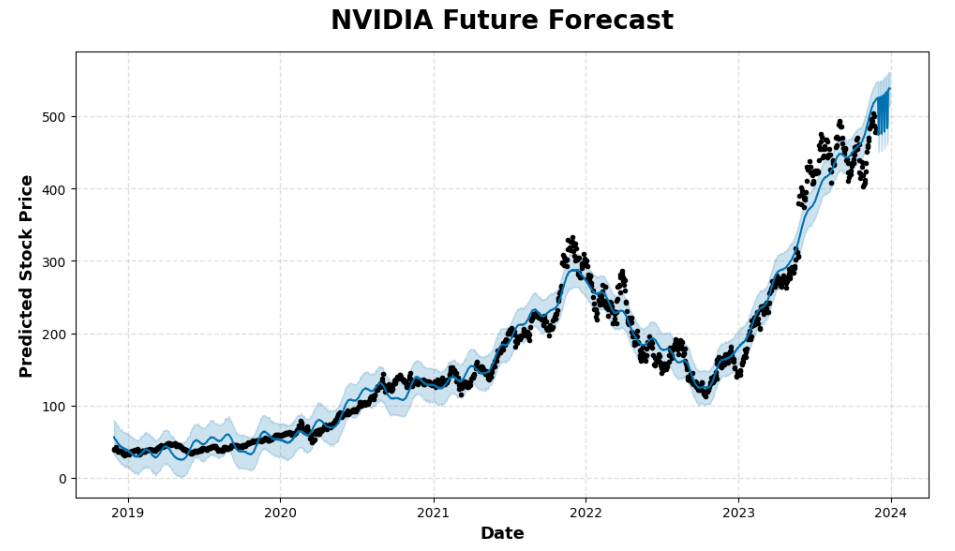

# 📈 Financial Time Series Analytics & Stock Forecasting System

## 📌 Project Overview

This project builds a complete Financial Time Series Analytics and Forecasting pipeline using historical stock market data of major technology companies.

The project focuses on analyzing stock market behavior, identifying long-term growth trends, measuring volatility and risk, performing rolling statistical analysis, and forecasting future stock movement using Time Series techniques.

The project uses historical stock data of major companies like NVIDIA, Tesla, Apple, Microsoft, Amazon, and Google to understand market movement and compare company-wise financial performance.

---


---

# 🎯 Project Objective

- Analyze historical stock market trends
- Compare company-wise financial performance
- Measure stock volatility and market risk
- Analyze daily stock returns
- Identify bullish and bearish market trends
- Perform rolling statistical analysis
- Forecast NVIDIA future stock movement
- Generate financial business insights using Time Series Analytics

---

# 🛠️ Technologies Used

## 📚 Libraries

- pandas
- numpy
- matplotlib
- seaborn
- plotly
- statsmodels
- prophet
- scikit-learn

---

# 📂 Dataset Information

The project uses a historical stock market dataset containing:

- Open Price
- High Price
- Low Price
- Close Price
- Trading Volume
- Dividends
- Stock Split Information
- Company Ticker

The dataset contains historical stock records of approximately 491 companies.

---

# 📊 Selected Companies

This project analyzes the following major technology companies:

```text
NVDA   → NVIDIA
TSLA   → Tesla
AAPL   → Apple
MSFT   → Microsoft
AMZN   → Amazon
GOOGL  → Google
```

---

# 🔄 Project Workflow

**Raw Stock Dataset → Data Cleaning → DateTime Processing → Feature Engineering → Financial EDA → Return Analysis → Rolling Statistics → Volatility Analysis → Trend Detection → Company Comparison → ARIMA Forecasting → Prophet Forecasting → Model Evaluation → Financial Insights**

---

# 🧹 Data Cleaning & Processing

The project includes multiple data cleaning and preprocessing steps such as:

- Missing value checking
- Duplicate row checking
- DateTime conversion
- Dataset sorting by company and date
- Chronological time-series preparation
- Company filtering
- Index resetting

---

# ⚙️ DateTime Feature Engineering

Created multiple DateTime features such as:

- Year
- Month
- Month Name
- Quarter
- Weekday

These features help analyze yearly growth, monthly movement, and seasonal stock behavior.

---

# ⚙️ Financial Feature Engineering

Created multiple financial indicators and engineered features such as:

- Daily Return
- Price Change
- Price Range
- Percentage Price Change
- Cumulative Return
- 7-Day Moving Average
- 30-Day Moving Average
- Rolling Volatility
- Trend Signal Detection

---

# 📊 Exploratory Data Analysis

The project includes analysis on:

- Closing Price Trend Analysis
- Trading Volume Analysis
- Daily Return Distribution
- Monthly Trend Analysis
- Yearly Growth Analysis
- Rolling Statistics Analysis
- Volatility Analysis
- Company-Wise Financial Comparison

---

# 📷 Project Images

## 📌 Closing Price Trend Comparison


## 📌 Daily Return Distribution


## 📌 Yearly Growth Trend Comparison


## 📌 NVIDIA Moving Average Analysis


## 📌 NVIDIA Rolling Volatility Analysis


## 📌 Actual vs Forecast Stock Price


## 📌 NVIDIA Future Forecast


---

# 📈 Financial Trend Analysis

The project analyzes historical stock movement using:

- Closing Price Analysis
- Market Trend Analysis
- Price Movement Analysis
- Return Analysis
- Growth Comparison
- Trading Activity Analysis

---

# 📉 Rolling Statistics Analysis

The project uses rolling statistical techniques such as:

- 7-Day Moving Average
- 30-Day Moving Average
- Rolling Mean Analysis
- Trend Smoothing
- Trend Detection

Rolling averages help identify short-term and long-term market movement patterns.

---

# 📊 Volatility Analysis

The project measures market instability and stock fluctuation using:

- Daily Return Volatility
- Rolling Standard Deviation
- Volatility Trend Analysis
- Risk Comparison

The analysis showed that NVIDIA experienced the highest volatility during major market uncertainty periods.

---

# 📌 Trend Signal Detection

The project includes trend signal logic to identify:

- Bullish Market Phase
- Bearish Market Phase
- Sideways Market Movement

Trend signals were generated using 30-Day Moving Average comparison.

---

# 📊 Financial Company Comparison

The project compares companies using:

- Average Return
- Average Trading Volume
- Average Price Range
- Long-Term Growth
- Volatility Comparison
- Risk vs Return Analysis

---

# 🤖 Time Series Forecasting

The project includes future stock forecasting for NVIDIA using:

## Models Used

- ARIMA
- Prophet

---

# ⚙️ Forecasting Workflow

The forecasting pipeline includes:

- Train-Test Split
- Time-Series Preparation
- ARIMA Modeling
- Prophet Modeling
- Future Forecast Generation
- Actual vs Forecast Comparison
- Forecast Visualization

---

# 📈 Model Evaluation

Forecasting performance was evaluated using:

- MAE (Mean Absolute Error)
- RMSE (Root Mean Squared Error)

Lower error values indicate better forecasting performance.

---

# 🔥 Key Business Insights

- NVIDIA showed the strongest long-term growth among all selected companies.
- Tesla showed the highest volatility and largest stock price movement.
- Apple, Microsoft, Amazon, and Google showed more stable long-term growth.
- NVIDIA and Tesla experienced larger daily return fluctuations compared to other companies.
- Rolling averages helped identify bullish and bearish market trends.
- NVIDIA experienced the highest market volatility during 2020.
- Tesla had the highest average trading activity among all selected companies.
- Google remained the most stable stock with lower average price fluctuation.
- ARIMA and Prophet forecasting models successfully captured NVIDIA’s future trend direction.
- Financial time-series analysis helps understand market behavior, trend movement, and risk patterns.

---

# 🎯 Final Conclusion

This project successfully performed end-to-end Financial Time Series Analytics using historical stock market data.
The final system demonstrates how Time Series Analytics and forecasting techniques can transform raw stock market data into meaningful financial insights and future trend analysis.

---

# 👨‍💻 About Me

## Sayan Naha

📧 **Email:** snsayan2012@gmail.com  
🔗 **LinkedIn:** [Sayan Naha](https://www.linkedin.com/in/sayan-naha/)
